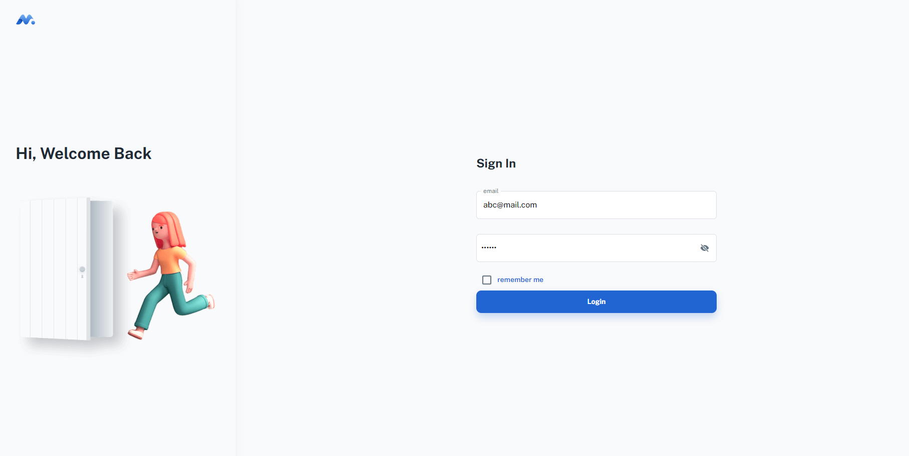

## Minimal [(Free version)](https://minimal-kit-react.vercel.app/)

> Free React Admin Dashboard made with Material-UI components and React.

| [Minimal Free](https://minimal-kit-react.vercel.app/) | [Minimal](https://material-ui.com/store/items/minimal-dashboard/) |
                                |

## Username and Password (Test)
abc@mail.com
123456

## Getting started

- Recommended `node js 16.x` and `npm 6+`. (suggestion v16.15.0)
- Install dependencies: `npm install` / `yarn install`
- Start the project: `npm run start` / `yarn start`

## License

Distributed under the MIT License. See [LICENSE](https://github.com/minimal-ui-kit/minimal.free/blob/main/LICENSE.md) for more information.

## Contact us

Email Us: support@minimals.cc
